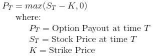
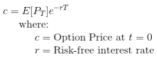
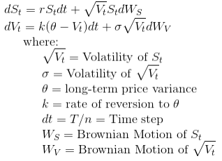
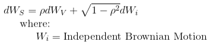
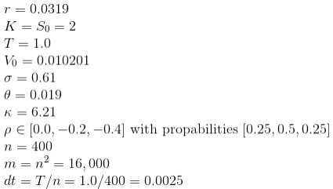

# Heston-Option-Pricing
A Monte Carlo option pricing simulation using the Heston model for stochastic volatility.

## Motivation
This repo was created to support an [OMIS 6000](https://schulich.yorku.ca/courses/omis-6000-3-00/) "Models & 
Applications in Operational Research" group project as part of a Master of Business Administration (MBA) from the 
[Schulich School of Business](https://schulich.yorku.ca/).

This goal of the project was to conduct a Monte Carlo analysis using Excel and the [FrontlineSolvers](https://www.solver.com/) 
add-in.  We extended this in Python to make a more robust simulation that can reduce the simulation error by increasing
both the number of time steps and the number of simulations. 

## Team Members
The development team members were:
- [Daniel Fudge](https://www.linkedin.com/in/daniel-fudge)
- [Chunan (Suzy) Zhang](https://www.linkedin.com/in/suzy-c-zhang-26234961/)
- [Teresa Lima](https://www.linkedin.com/in/teresa-cristina-de-s%C3%A1-lima-01966453)
- Rita Bai
- Junwei Lu
- Jeff Qiao

## Theory
This code estimates the present value of, and hence price, an European call option on a given stock.  The payout of the 
option at maturity (time = _T_) is given by the equation below. 

The present expected value of the option, which is the price _c_, is given by the equation below.  

So the problem becomes making many stochastic projections of the possible evolutions of the stock price _St_ 
from _S0_ to _ST_ and then taking the average values of _PT_ to estimate 
_E[PT]_ in the above equation.  To do this we used the Heston Model, which includes a stochastic term for 
both the price movement and its volatility as shown in the equation below. 

The correlation of the two Brownian motions _dWS_ and _dWV_ is represented by the coefficient 𝜌.
Therefore we determined _dWS_ from the following equation.

To perform the simulation, we generated _n_ independent random values of _dWi_ and _dWV_ from a 
normal distribution with a mean of 0 and standard deviation of sqrt(_dt_).  Starting with initial values of 
_S0_ and _V0_, the constants 𝜎, 𝜃, 𝜅, _dt_, 𝜌 and the random variables _dWi_ and 
_dWV_, we then calculate the time evolution of both _St_ and _Vt_.  We repeated this 
_m_ times to estimate the mean expected value.  Following the paper by Broadie, we will set the following constants.

To add a third random term, we repeated this process another _p_ times with discrete random values for 𝜌 as shown above.
The mean of these _m*p_ values of _PT_ allows us to estimate _E[PT]_ and hence the option price 
_c_.

### References
Mark Broadie and Ozgur Kaya. “Exact Simulation of Stochastic Volatility and other Affine Jump Diffusion Processes.” 
_Operations Research_, Vol. 54, No. 2, March-April, 2006, DOI: 10.1287/opre.1050.0247. 
[pdf link](http://www.columbia.edu/~mnb2/broadie/Assets/broadie_kaya_exact_sim_or_2006.pdf) 

## How to execute the program
TODO

## Summary of results
TODO

## License
This code is copyright under the [MIT License](LICENSE).

## Contributions
Please feel free to raise issues against this repo if you have any questions or suggestions for improvement.